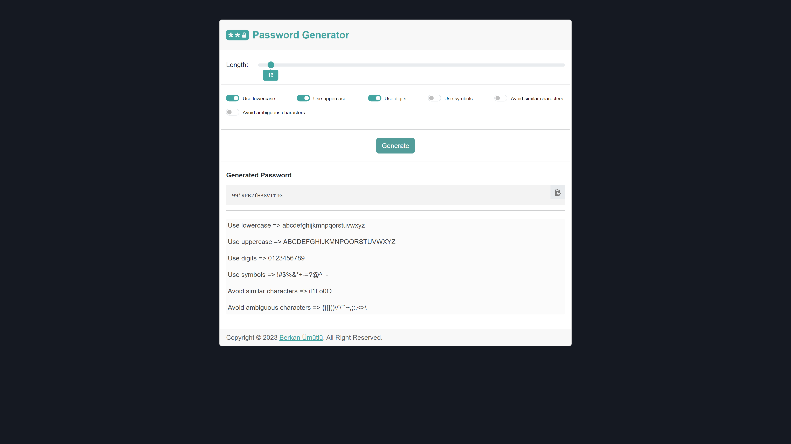

    

<a href="https://www.php.net/releases/5_6_0.php" target="_blank" rel="nofollow">=5.6-777BB4?logo=php&logoColor=white&labelColor=777BB4" alt="PHP Version"></a>

# PHP Password Generator

It is a project that allows you to create random passwords between 8 and 256 characters using uppercase and lowercase letters, numbers, special symbols, and ambiguous characters.

# Screenshots

## License

The MIT License (MIT). Please see [License File](LICENSE) for more information.